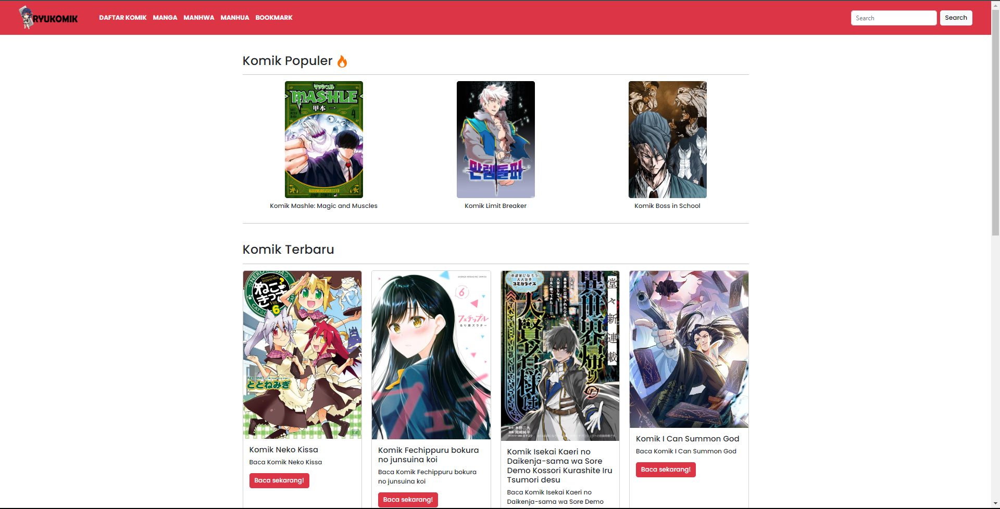

# RYUKOMIK | Baca Komik

A simple manga read web, based on NextJS

## Website View

## API Source

This project using public api from [KatowProject](https://github.com/KatowProject/komikato_py)

## Features

- Read Manga with no ads
- Bookmarked your manga
- Detail Comic
- Japan Comic (Manga)
- Korean Comic (Manhwa)
- Chinese Comic (Manhua)

## Requirements

- NodeJS (V18 or higher)

## Installation on Localhost

1. clone the repository
2. type `npm install` for downloading dependencies (Node modules)
3. run `npm run dev` or `yarn dev` for run on your localhost

## Installation on Vercel

1. fork the repository
2. Open [Vercel Platform](https://vercel.com/) for more details, you can check [Documentation](https://nextjs.org/docs/pages/building-your-application/deploying)
